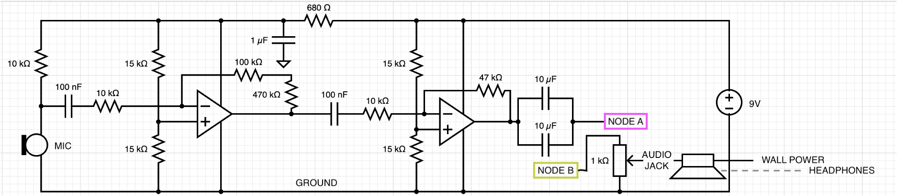
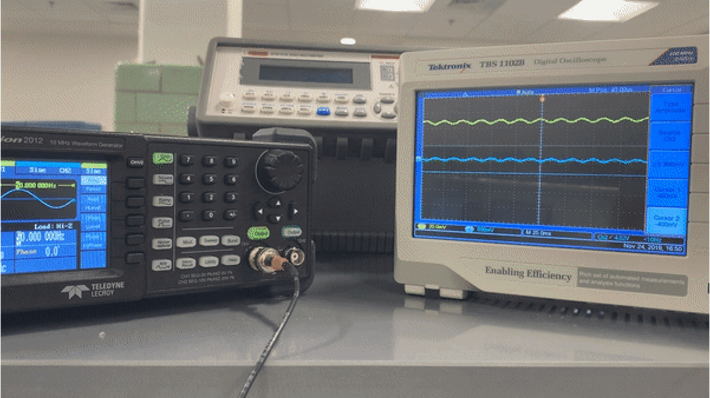
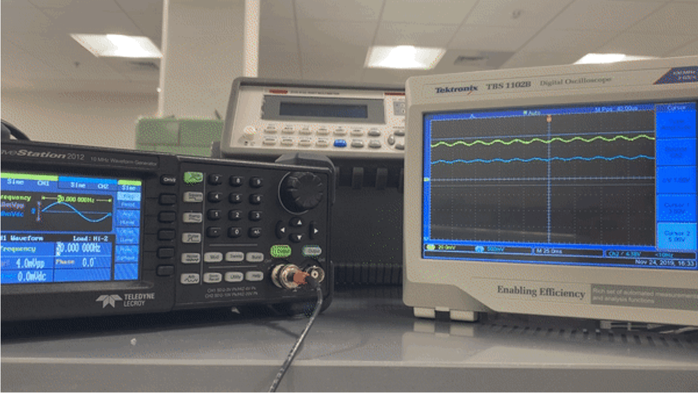
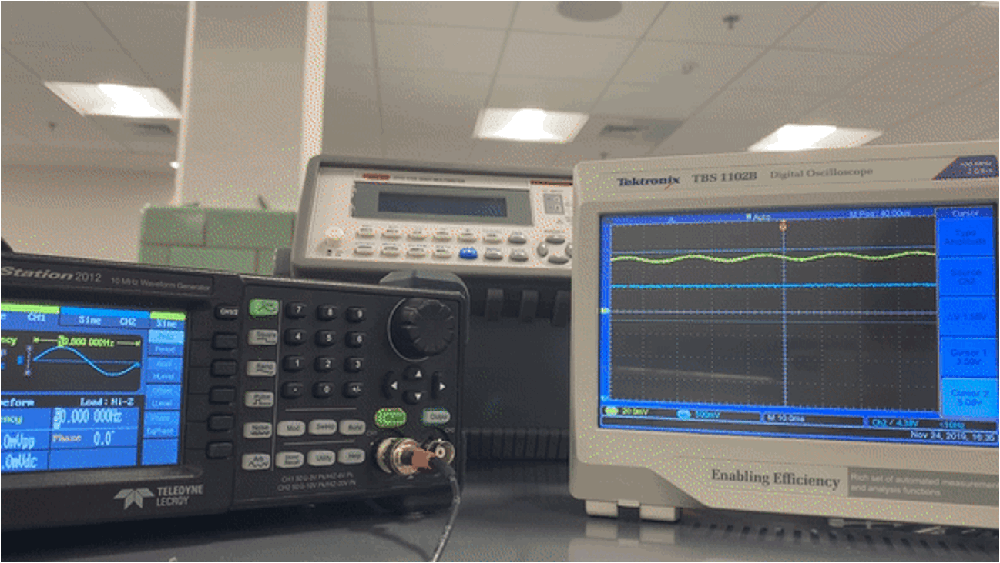

# Three-band Hearing Aid

**More info in the presentation!**
- background
- quantitative review
- Bode plots
- other frequency and gain plots

# Design

circuit

without optional filtering - increase the frequency from 50Hz - 7000Hz

with band pass filter

with high pass filter

